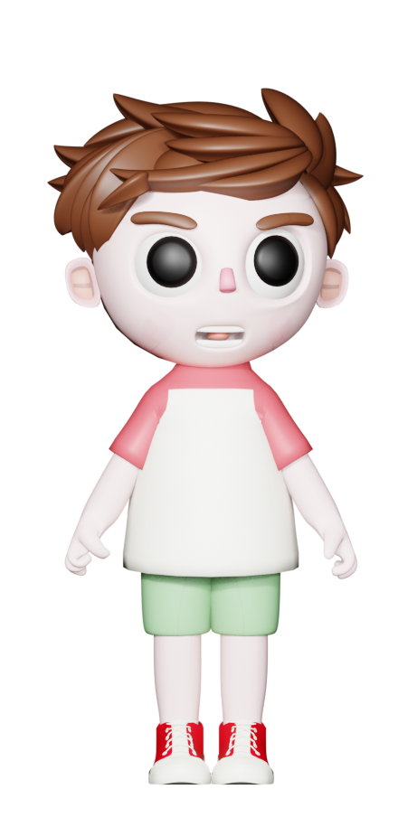

# BG Remover

Remove backgrounds from images with [RMBG-1.4](https://huggingface.co/briaai/RMBG-1.4), a small open AI model. Two ways to use it:

| Tool | Where it runs | Setup |
|------|---------------|-------|
| **[Web version](https://hp980322.github.io/bg-remover-web/)** | In your browser, no install | Just open the link |
| **[Blender add-on](blender/)** | Inside Blender, no internet after first run | Drop in one `.py` file |

Both produce **byte-identical** alpha masks for the same input image — same model, same preprocessing, same edge cleanup.



## Web version

Open https://hp980322.github.io/bg-remover-web/ in any modern browser.

- Drag and drop an image, get a transparent PNG back.
- Runs entirely client-side via [transformers.js](https://github.com/huggingface/transformers.js) and onnxruntime-web (WebAssembly).
- Nothing is uploaded — the model and your image stay on your device.
- Includes the `cleanMask v16` post-processor: K-means background detection, sky-region handling, morphological cleanup, anti-aliased edges.

## Blender add-on

Single-file add-on for Blender 3.0+. Removes backgrounds from images, render results, and image sequences directly inside Blender.

See **[blender/README.md](blender/README.md)** for installation and usage.

Highlights:

- **Single file.** Download `blender/bg_remover_addon.py`, install it through Edit → Preferences → Add-ons.
- **Auto-installs everything else.** First time you enable it, the addon automatically installs `onnxruntime`, `numpy`, `scipy`, and `Pillow` into Blender's bundled Python and downloads the 176 MB ONNX model. No manual pip, no system Python, no virtual environments.
- **Stays responsive.** Install runs on a background thread so Blender's UI doesn't freeze.
- **Same output as the web version.** The post-processing algorithm is ported from JavaScript to Python and verified pixel-identical against the web reference on 150,000+ test pixels.

## Repository layout

```
.
├── index.html              ← web version (single page, served via GitHub Pages)
├── logo.png
├── blender/
│   ├── bg_remover_addon.py ← Blender add-on (single file)
│   ├── README.md           ← addon docs
│   └── requirements.txt    ← list of pip deps (for reference; addon installs them automatically)
└── README.md               ← this file
```

## How it works (briefly)

1. Image is resized to 1024×1024 and normalized.
2. RMBG-1.4 (an ONNX export of [briaai/RMBG-1.4](https://huggingface.co/briaai/RMBG-1.4)) produces a single-channel foreground probability mask.
3. Mask is min-max normalized, resized back to source dimensions.
4. Optional `cleanMask v16` post-processor refines the mask:
   - Builds a background color model via K-means on edge pixels.
   - Removes small foreground fragments and fills small background holes.
   - Iteratively cleans up sky regions (small bluish blobs) and grows foreground into nearby body-colored pixels.
   - Removes thin sky stripes per row.
   - Anti-aliases edges via 3×3 box blur.
5. Output is RGBA — original RGB with the mask as the alpha channel.

The cleanMask algorithm lives in `index.html` (JavaScript, source of truth) and is ported verbatim to Python in the add-on.

## License

Add-on and web code: do whatever you want, attribution appreciated.

The RMBG-1.4 model is by Bria AI under their own license — see [their model card](https://huggingface.co/briaai/RMBG-1.4) before commercial use.

## Issues / feedback

[Open an issue](https://github.com/HP980322/bg-remover-web/issues) on this repo.
